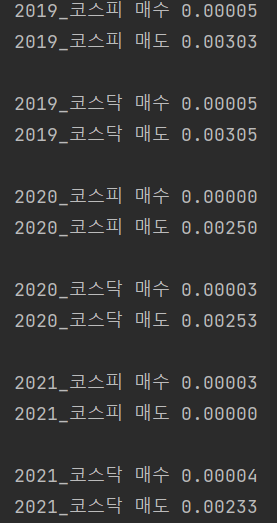

# Openpyxl and Pandas for Excel

## 목차

1. [제작배경](#제작배경)

2. [trade_check.py](#1. trade_check.py)

3. [cost_check.py](#2.-cost_check.py)

4. [결과](#3.-결과)

### 제작배경

주식 거래에 드는 수수료, 제세금을 알아보려 했더니 규정이 명확하지 않았다.

증권사 따라 

계좌 개설 방식 따라 

개설 시기 따라 수수료가 다르고

코스피냐 코스닥이냐 코넥스냐  ETF냐 한국 주식이냐 미국 주식이냐에 따라 

증권거래세 다르고 농어촌특별세 다르고 등등

그것도 매년 세금 규정이 바뀌는 듯 하였다.

내 계좌의 수수료를 확인할 수 있는 기능이 없길래 **직접 계산**을 위해 거래내역을 엑셀로 받았다.

한국투자증권의 거래내역 파일을 이용했다.

>코드가 길어 상세 설명은 
>
>각 파일의 주석으로 대체한다.

### 1. trade_check.py

​	각 거래에 대해 수수료, 거래세, 세금이 존재한다면  비용/거래금액을 딕셔너리에 분류하여 저장했다.

​	그 후 엑셀 파일을 만들어 연도별 코스피/코스닥으로 나눠 각각 별도의 시트에 딕셔너리를 저장하였다.

### 2. cost_check.py

​	trade_check에서 저장한 엑셀의 각 셀에는 모든 비용이 리스트로 저장되어 있다.

​	엑셀을 읽어와서 데이터를 파싱하여 리스트로 만들고, 최고값을 찾아 수수료, 거래세, 세금을 더했다. 

​	총 비용을 반올림 후 부동 소수점으로 출력하였다.

### 3. 결과

​	2021년은 코스피 매도 자체가 없었다. 

​	연도별로 비용이 어느정도 일관성을 보이며 매년 비용이 바뀌고 있는 것이 보인다.

​	매수, 매도에 대해 비용이 다르다. 

​	증권거래세와 농어촌 특별세가 매도시 가격에 적용되어 그런 듯 하다.
