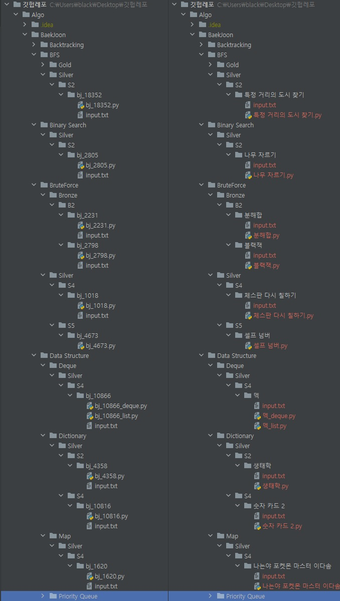

## rename_file

```python
import os
import requests
from bs4 import BeautifulSoup

def change(tag_path, grades):
    for grade in grades:  # 문제 등급(실버 브론즈 등)
        grade_path = os.path.join(tag_path, grade)
        grade_nums = os.listdir(grade_path)
        nums = list(grade_nums)
        for num in nums:  # 문제 등급 레벨 순회(실버2 골드5 등)
            num_path = os.path.join(grade_path, num)
            num_problems = os.listdir(num_path)
            problems = list(num_problems)
            for problem in problems:  # 문제 등급 내 문제폴더들 순회
                problem_path = os.path.join(num_path, problem)
                if 'bj' in problem:  # bj_12345 등으로 작성돼있는 예전 양식만
                    bj, pro_num = problem.split('_')  # 문제 번호만 추출
                    url = f'https://www.acmicpc.net/problem/{pro_num}'  # 문제 주소
                    response = requests.get(url)
                    if response.status_code == 200:
                        html = response.text
                        soup = BeautifulSoup(html, 'html.parser')
                        title = soup.select_one('#problem_title').getText().strip()  # 문제 제목만 가져오기
                        title = title.replace('?', '？')
                        problem_files = os.listdir(problem_path)
                        files = list(problem_files)
                        for file in files:  # 문제 폴더 내 파일 순회
                            if file.startswith('bj') and file.endswith('.py'):  # bj_12345 형태로 되어있는 파이썬 파일만
                                bj_pro, extension = file.split('.')  # 확장자 분리
                                datas = bj_pro.split('_')
                                original_title = datas[0] + '_' + datas[1]  # 기존 파일 이름에서 bj_12345 부분만
                                new_title = file.replace(original_title, title)  # 기존 파일 이름에서 bj_12345 부분만 제목으로 교체
                                os.rename(os.path.join(problem_path, file),
                                          os.path.join(problem_path, f'{new_title}'))  # 파일명 수정
                                print(f'{bj_pro}를 {title}로 변경')
                                ans[0] += 1
                        os.rename(problem_path, os.path.join(num_path, f'{title}'))  # 문제 폴더명 수정


BaekJoon = 'C:/Users/black/Desktop/깃헙레포/Algo/BaekJoon'
file_list = os.listdir(BaekJoon)  # BaekJoon의 폴더리스트
tags = list(file_list)  # 굳이 list로 안바꿔도 작동하지만 디버깅때 보기 편하게 리스트 사용.
ans = [0]
for tag in tags:  # 문제 태그들 순회
    tag_path = os.path.join(BaekJoon, tag)
    tag_grades = os.listdir(tag_path)
    if tag in ['Data Structure', 'Minimum Spanning Tree', 'Shortest Path']:  # 해당 폴더들은 하위에 등급이 아니라 상세태그가 있음.
        tag2s = list(tag_grades)
        for tag2 in tag2s:
            tag2_path = os.path.join(tag_path, tag2)
            tag_grades = os.listdir(tag2_path)  # 상세태그 내부 등급폴더들
            grades = list(tag_grades)
            change(tag2_path, grades)
    else:
        grades = list(tag_grades)
        change(tag_path, grades)
print(f'{ans[0]}개 변경 완료')

```

os.rename으로 파일/폴더의 이름을 변경할 수 있다.

----------------------------

백준에서 푼 문제들은 bj_12345_deque 이런 식으로 저장해뒀었다. 폴더를 통해 분류는 되지만 같은 분류의 문제끼리 구분이 힘들었다. 폴더 명과 파일 명을 문제의 이름으로 수정하려 했고, 세 자리 수 단위의 폴더와 파일을 손으로 수정할 수는 없어 파일을 작성했다.


### 변경 전후 비교



### 

