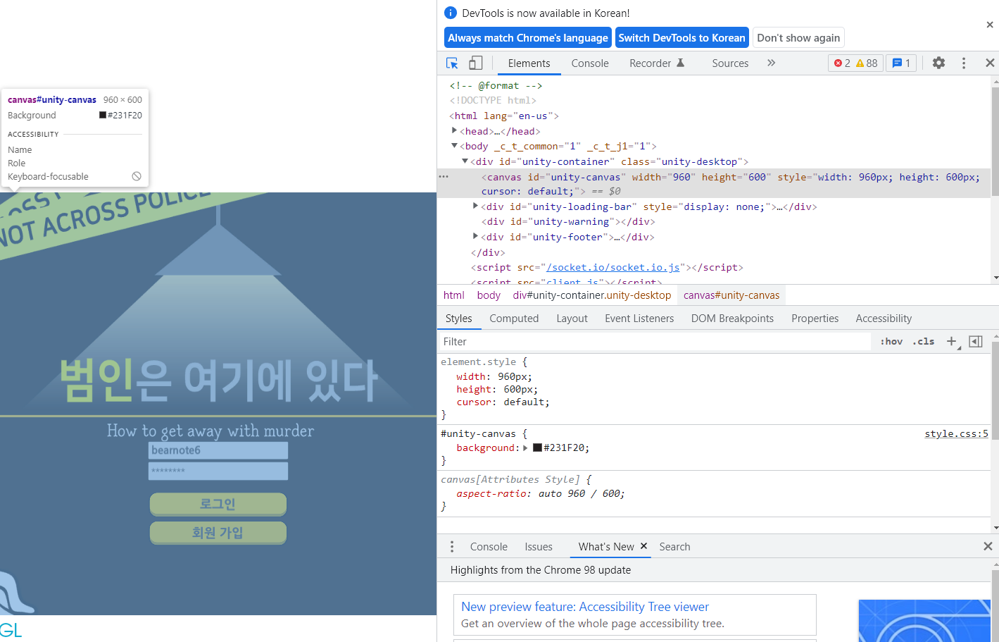
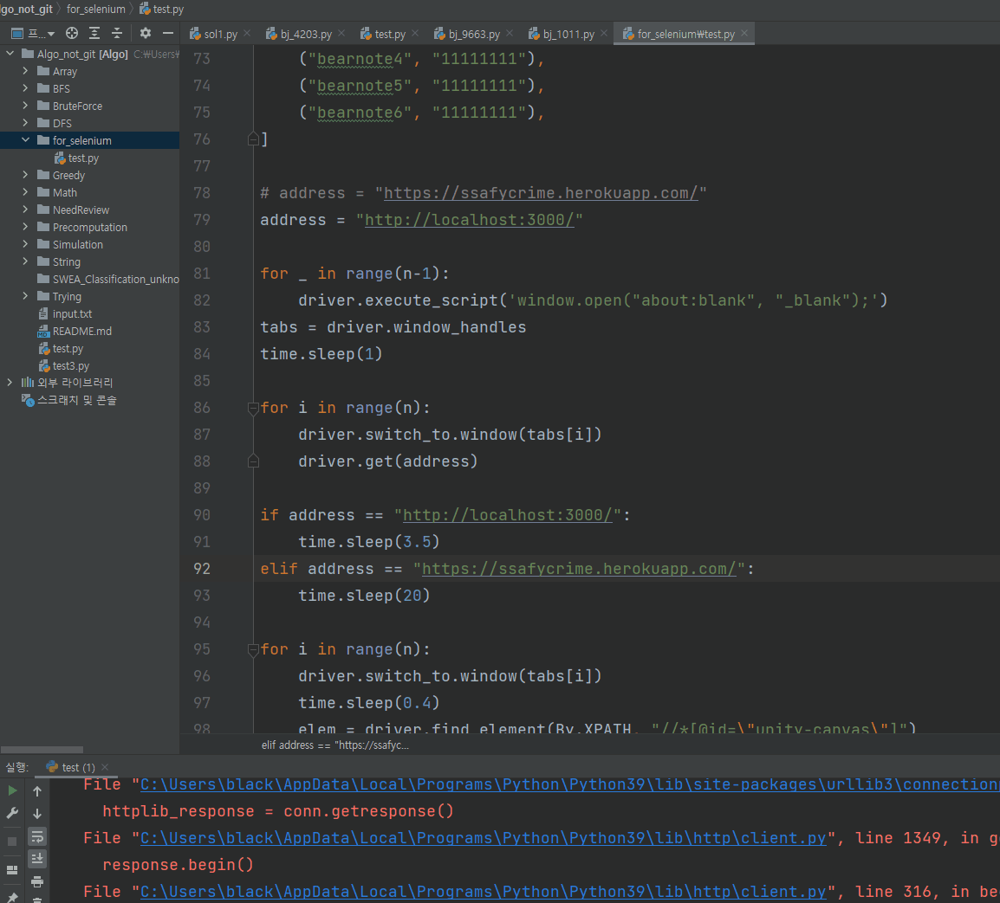

# Login Bot

## 목차

1. [제작배경](#제작배경)

2. [과정 및 방법 선택 이유](#과정-및-방법-선택-이유)

3. [완성본](#완성본)

### 제작배경

[인크라임](https://github.com/ohzeno/Incrime)을 진행하며 테스트를 위해 6계정을 매번 새로 로그인 할 필요가 있었다.

매번 손으로 6개의 창을 띄우고 6개의 로그인을 하여 방을 만들고 접속하는 것이 번거로워 자동화를 시도했다.

셀레늄의 존재를 모르는 채로 시작했으며 아래 과정은 4시간정도 소요되었다.

캔버스 상대좌표 클릭이라는 특수환경이라 하드코딩으로 작성했다.

평범한 웹사이트라면 훨씬 빠르게 작성 가능했을 것이라 추정한다.

### 과정 및 방법 선택 이유

1. 크롬에서 개발자도구를 켜서 로그인, 패스워드 엘리먼트를 찾으려 했다.

   1. 

      사진에서 보는 바와 같이 input feild가 따로 엘리먼트로 지정되지 않고 unity-canvas의 단일 엘리먼트로 나온다.

2. 그렇다면 http크롤링으론 불가하다 판단하여 화면을 직접 클릭할 수 있는 도구가 있는지 찾아보았다.

   1. 셀레늄을 찾았고, Python으로 제작 가능함을 확인했다.

3. 셀레늄, 크롬드라이버 설치

4. 셀레늄에서 크롬 창 띄우는 방법 검색, 적용

5. 셀레늄에서 클릭하는 방법 검색

   1. 대부분 엘리먼트 자체에 클릭이벤트를 보내는 내용이었다.
   2. 구글링으로 엘리먼트 지정 없이 클릭이벤트를 보내는 방법을 찾았다.
      1. 캔버스 자체에서 상대좌표로 클릭하는 것이 편하겠다 생각하여 상대좌표 찾는 방법을 검색하고 적용했다.
         1. 엘리먼트의 상대좌표로 마우스를 옮기는 방법을 적용하였다.
         2. 그 좌표에서 마우스 클릭을 시도하였다.
         3. 클릭을 확인할 수 없었기에 클릭을 확인하는 방법을 찾아보았다.
         4. 우클릭으로 확인이 가능하다는 내용을 찾았다.
            1. 우클릭이 확인되지 않았다.
            2. 직접 우클릭을 해도 메뉴가 표시되지 않는다는 점을 확인했다.
         5. 셀레늄 자체의 사용법을 익혀야겠다 생각하여 네이버에서 엘리먼트를 지정하여 상대좌표를 클릭하는 방법을 시험해봤다.
            1. 해당 방법을 적용하여 for문으로 클릭 후 time.sleep으로 시간을 주며 클릭이 되는 좌표를 확인하였다.

6. 클릭 확인 후 패스워드 입력방법을 찾아보았다.

   1. 엘리먼트를 지정하여 텍스트를 보내는 방법이 주로 검색되었다.
   2. 엘리먼트 지정 없이 텍스트를 입력하는 방법을 검색하였다.
   3. ActionChains를 사용하여 엘리먼트 지정 없이 텍스를 입력하는 방법을 찾아 적용하였다.
   4. 처음에는 클릭-입력을 시간간격 없이 시행하였으나 작동하지 않았다.
   5. time.sleep으로 시간여유를 주어 입력하니 성공하였다.

7. 이후 각각의 행동에 시간간격을 두고 조정하며 각 행동을 작성하였다.

   1. 로그인 버튼 클릭
   2. 로그인 성공 팝업 닫기
   3. 방 이름 입력
   4. 방 만들기

8. 하나의 탭은 성공하였으니 다음 탭을 제어하기 위해 탭을 여러 개 띄우는 방법을 검색하였다.

9. 여러 탭을 한 창에 띄우는 방법을 찾아 시도해보았고 성공했다.

10. 탭간 포커스 전환 방법을 검색하여 시도해보았고 성공했다.

11. 이후 여러 탭을 돌아가면서 로그인 하는 내용을 작성하였다.

    1. 탭마다 바로 로그인을 시도하기엔 캔버스 로딩이 느렸다.
    2. 탭마다 주소 이동 후 시간텀을 두고 다시 처음 로딩 시작한 탭으로 돌아와서 로그인, 방 만들기를 시도했다.
       1. 아이디, 비밀번호는 리스트에 튜플로 넣어두고 차례대로 가져와 사용하였다.
    3. 첫 탭을 제외하고는 방을 만들 필요가 없기에 방찾기 버튼을 찾아 클릭하도록 작성하였다.

12. 방 접속은 작성하지 않았다.

    1. 로비에 방이 여럿 있을 수 있으며, 엘리먼트 지정이 불가하기에 내가 만든 방의 상대좌표를 구하는 것이 불가능했다.
    2. 그래서 방찾기 버튼을 찾아 클릭하는 것으로 나머지 5개의 탭의 동작은 종료하였다.

### 완성본

